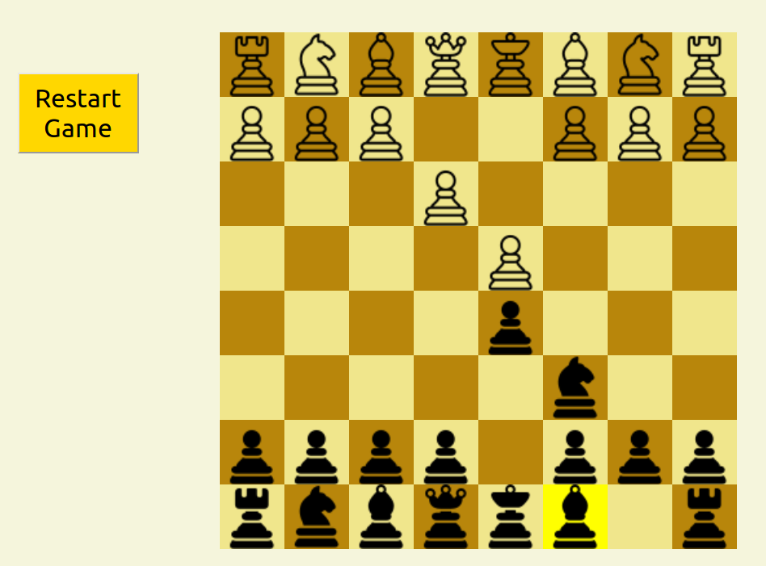

# midterm_ChessGame



## 簡介
  我本身很喜歡下西洋棋，因此midterm project做的是一個線上的西洋棋遊戲，可以讓兩個使用者線上對奕(目前還無法讓多個使用者登錄同時玩)

## 安裝說明
需要在三個地方安裝套件
```
npm install
cd client/
npm install
cd ../backend/
npm install
```

## 使用方式
在 ```midterm_ChessGame/```  下輸入 ```npm start```。
瀏覽器打開 localhost:3000, 即可看到如圖的棋盤，可以跟另外一名使用者對奕。移動棋子的方式是點擊想移動的棋子，再點擊目標的格子，即可將棋子放到指定的位置，也可以在棋局結束或是惱羞想翻賴皮的時候按下 ```Restart Game``` 鍵重新開始。

## 功能
1. 後端紀錄棋局,使不同使用者打開瀏覽器看到的棋局統一 
2. 按下想意移動的棋子時，該棋盤格會變色，(但只有點擊的使用者看得到)，以免不小心移動到別的棋子
3. 不同陣營的棋子可以互相「吃掉」，被吃掉的棋子會自動移到敵方陣營的棋盤後方(像是戰俘)，方便玩家衡量局勢。(防呆機制:同陣營的無法互相吃掉)
4. 後端以console顯示每一步，可以在棋局進行的時候幫助玩家記錄
5. 可以按下 ```Restart Game``` 重設遊戲

## 架構
* React.js & CSS: 建構前端，根據後端的資料顯示棋子的位置，將移動棋子的意圖傳給後端 
* Node.js： 移動並更新棋子位置，傳送給所有前端
* Socket.io: 前後端資料傳遞
* Mongoose: 用資料庫紀錄紀錄所有棋子和雙方戰俘位置的座標

## 貢獻
這次的midterm project沒有參考別人寫好的project, 如何紀錄位置和顯示棋子、棋盤都是自己不斷的try and error而來, 但棋子的圖案是下載來的,不是CSS畫的。

## 未來可以增加的功能
1. 可以讓多人連線捉對廝殺
2. 用拖曳的方式移動棋子提昇真實感
3. 讓不同棋子只能移到合法的位置(e.g. 主教只能走斜的)，並顯示這些位置
4. 自動判斷check, checkmate 等狀況
5. 增加時間限制

## 感想
這次的midterm project 讓我複習了一下react.js，對於一些特性也有更進一的理解。對於後端技術我原本沒經驗，相當陌生，但是查了許多的教學之後慢慢嘗試，到最後完成這個小遊戲滿開心的，但是功能還是頗為陽春。現在對於前後端如何溝通有了初步概念，希望可以在final proejct更快上手。